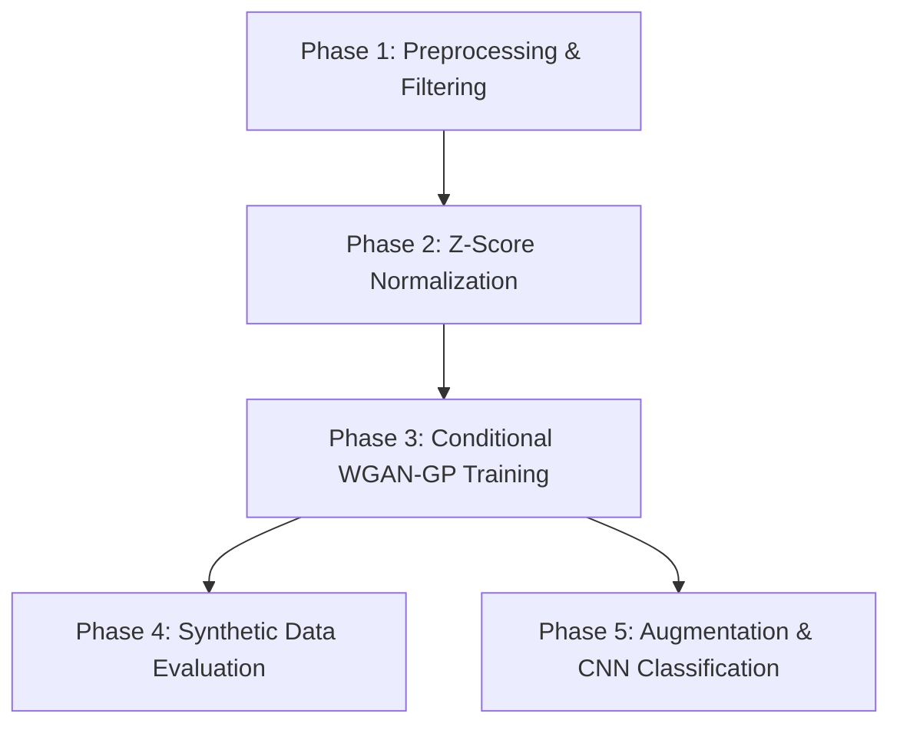

# Motor Imagery EEG Classification and Synthetic Data Generation with WGAN-GP

This repository contains the codebase for my motor imagery EEG project as part of my Summer Internship at DEBEL, DRDO. The goal is to generate synthetic EEG signals and classify motor imagery tasks (Left Hand vs. Right Hand) using deep learning. The project uses the BCI Competition IV Dataset 2a (focusing on the C3, Cz, and C4 electrode channels over the primary motor cortex) and is implemented step-by-step in [code_version5_55.ipynb](code_version5_55.ipynb).


## Core Workflow


The project is structured into five distinct phases, moving from raw signal preprocessing to generative modeling and final classification.



### Phase 1: Preprocessing & Filtering
* Loaded the raw GDF files using the MNE-Python library.
* Solved the BCI Competition's evaluation labeling restriction: loaded the MATLAB `.mat` files to replace the cheat-prevention event placeholders (code `'783'`) in the GDF files with the true test class labels.
* Isolated the C3, Cz, and C4 channels to target the primary motor cortex.
* Applied a bandpass filter (8-30 Hz) to focus on the Mu (8-12 Hz) and Beta (13-30 Hz) sensorimotor rhythms.
* Epoched trials from 2.0s to 6.0s post-cue (1001 time steps at 250 Hz sampling rate) to capture the steady state of motor imagery.
* Scaled values using a MinMaxScaler and saved preprocessed arrays into `.npy` files for instant loading.

### Phase 2: Z-Score Normalization
* Standardized the EEG signals using per-trial, per-channel z-score normalization. This is crucial for EEG signals as global scaling fails to account for temporal baseline drifts across trials and subjects.
* Reshaped the input tensors to add a singleton dimension (converting shapes to `[samples, channels, time, 1]`) to prepare the data for the 2D CNN classifier.

### Phase 3: Conditional WGAN-GP Model
* Developed a Conditional Wasserstein GAN with Gradient Penalty (WGAN-GP) to generate synthetic trials for both classes (Left Hand = 0, Right Hand = 1).
* **Generator:** Combines a 100-dimensional noise vector with a 50-dimensional class label embedding. Upsamples the sequence length from 125 to 1001 using 1D convolutions combined with bilinear resizing (instead of standard transposed convolutions) to prevent checkerboard artifacts in the generated waveforms.
* **Critic:** Evaluates sequence inputs of shape `(1001, 3)` alongside the label vector, downsampling the temporal resolution using 1D convolutions with strides of 2.
* **Training Loop:** Compiles a custom step that trains the Critic 5 times for every 1 Generator step. Implements a gradient penalty term (by calculating gradients of mixed real/fake samples) to enforce Lipschitz continuity and stabilize adversarial training.

### Phase 4: Synthetic Data Evaluation
To evaluate how well the generator learned the distributions of real brainwaves, I implemented several validation checks:
* Visualized time-domain comparative waveforms of real vs. generated trials.
* Ran Fast Fourier Transform (FFT) to compare average power spectra, confirming that the generator replicates key frequency characteristics in the 8-30 Hz sensorimotor bands.
* Computed the Pearson Correlation Coefficient per channel to check the average wave contour match.
* Calculated the Sliced Wasserstein Distance (SWD) to mathematically measure the similarity between high-dimensional real and synthetic datasets.

### Phase 5: Augmentation & CNN Classification
* Partitioned the real training set into training (80%) and validation (20%) portions. The validation set is kept strictly real to ensure early stopping is not biased by synthetic artifacts.
* Generated synthetic trials matching the training set distribution to double the training dataset size.
* Built and trained an EEGNet-style CNN model consisting of a temporal convolution, a spatial depthwise convolution (learning combinations across C3, Cz, C4), and a separable convolution layer.
* Shuffled the augmented training dataset and trained the CNN, evaluating final metrics (accuracy, precision, recall, F1 score) on the unseen real test set.

---

## Directory Layout

* `code_version5_55.ipynb` - Notebook containing the complete implementation with 55 epochs of GAN training.
* `BCICIV_2a_gdf/` - Folder containing the raw GDF datasets and Matlab `.mat` label files.
* `.npy` files - Preprocessed training/testing datasets saved for fast runtime loading.

---

## Installation & Setup

Install project dependencies using `pip`:

```bash
pip install tensorflow mne numpy scikit-learn scipy matplotlib
```
