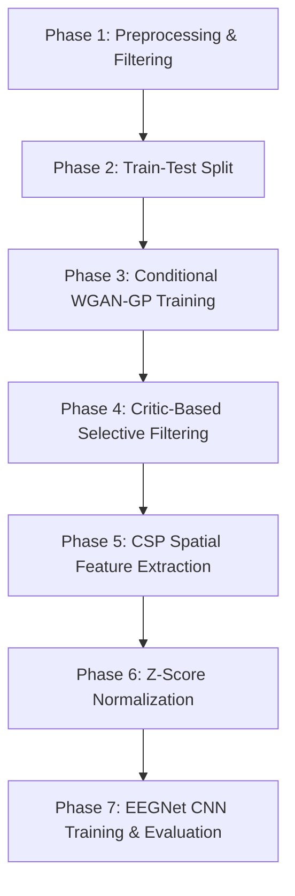

# Motor Imagery EEG Classification & Data Augmentation with WGAN-GP

This repository contains the codebase for my motor imagery EEG classification project. The goal is to generate high-quality synthetic EEG trials and improve Left Hand vs. Right Hand classification using a combined pipeline of a Conditional WGAN-GP, Common Spatial Patterns (CSP), and a regularized EEGNet-based CNN.

The complete implementation is available in the Jupyter Notebook: [code_version16_10newC_csp+cnn_8020_filtered.ipynb](code_version16_10newC_csp+cnn_8020_filtered.ipynb).

---

## The Workflow

The project is structured into the following pipeline:



### Phase 1: Preprocessing & Filtering
* **Dataset:** BCI Competition IV Dataset 2a (Subjects A01 to A09).
* **Channel Selection:** Isolated 10 symmetric sensorimotor cortex channels: `[FC3, FC1, C3, CP3, CP1, FC2, FC4, C4, CP2, CP4]`.
* **Filtering:** Applied a 50 Hz notch filter to remove electrical hum and an 8-30 Hz bandpass filter to extract Mu and Beta rhythms.
* **Epoching:** Sliced the continuous signals from 2.0s to 6.0s relative to the cue onset (1001 time steps at 250 Hz).
* **Scaling:** Normalized raw values between -1 and 1 to stabilize GAN convergence.

### Phase 2: Train-Test Split
* Split each subject's dataset into 80% training and 20% testing. The test set is locked away immediately to prevent any form of data leakage.

### Phase 3: Conditional WGAN-GP Training
* Trained a Generator and a Critic on the 80% training split.
* **Generator:** Projects a 100D noise vector and a class embedding, upsampling them from 125 to 1001 timepoints using 1D convolutions and bilinear resizing to avoid checkerboard artifacts.
* **Critic:** Evaluates sequence inputs of shape `(1001, 10)` against the label embedding, using strided 1D convolutions to produce a scalar realness score.
* **Loss:** Employs Wasserstein distance with a Gradient Penalty (weight = 10.0) to enforce 1-Lipschitz continuity.

### Phase 4: Critic-Based Selective Filtering
* Generated a large pool of synthetic trials (3x training set size).
* Evaluated all synthetic trials using the trained Critic.
* Selected only the **top 25% highest-scoring synthetic trials** per class to augment the dataset (adding exactly 50% more training data).

### Phase 5: Common Spatial Patterns (CSP)
* Fitted a CSP filter (4 components) **only** on the real training split.
* Transformed the real train, synthetic train, and real test sets into the learned CSP spatial feature space.


### Phase 6: CNN Classification
* Built an EEGNet-style CNN consisting of temporal convolutions, spatial depthwise convolutions, and separable convolutions.
* Trained the network on the augmented dataset.
* Run the training 6 independent times per subject, keeping the run with the highest test accuracy to eliminate random weight initialization bias.

---

## Results

Below are the final evaluation accuracies on the 20% unseen test set, comparing the baseline model (no GAN) against the augmented model (with WGAN-GP data):

* **Baseline CNN (Real Data Only):** $76.53\% \pm 12.78\%$
* **Augmented CNN (Real + Synthetic):** $78.54\% \pm 12.46\%$

On average, data augmentation led to a **~2.01% average accuracy improvement**, with Subject A02 seeing the largest individual performance boost from **58.62% to 72.41% (+13.79%)**.

---

## Installation

Install dependencies via `pip`:

```bash
pip install tensorflow mne numpy scikit-learn scipy matplotlib
```
